* Link to dataset (too big for github) : https://drive.google.com/drive/folders/1ELKcQACYUjB4YCqhNm5p7lXxZmjS0f6V?usp=sharing
* Tableau visualisation : https://public.tableau.com/app/profile/aloysius.ang/viz/USaccident2016-2023/MainStory

# Overview 📈📊
In this project, I found a dataset on US traffic accidents report from 2016 to 2023. This dataset consist of over 7 million rows with 48 columns of data. It is a huge file. By utilizing Python and tableau, I attempted to perform data wrangling and cleaning. After those processes, the cleaned data set will be transfer to tableau for exploratory data analysis. I am here to share the many insights that had been found within the exploratory data analysis.

# Introduction 📈📊
This extensive dataset captures car accidents nationwide, which consist of 49 states in the USA. This dataset spans from February 2016 to March 2023. It aggregates information from multiple APIs that stream real-time traffic incident data. These APIs source data from diverse entities. This includes the US and state departments of transportation, law enforcement agencies, as well as traffic cameras and sensors embedded in the road networks. The dataset comprises approximately 7.7 million accident records.

The objective of this analysis is to come out with meaningful insights that can inform policy decisions in the US. Using this huge dataset, the aim is to identify key areas of concern and potential pain points. Ultimately, the goal is to provide valuable information to policymakers. Strategic recommendations can be introduced to collectively reduce traffic accidents nationwide. With this analytical process, the effect of this analysis will strive towards making the roads in US safer for all commuters. 

Here are the columns that are in the dataset and what it represents.
* ID - This is a unique identifier of the accident record.
* Source - Source of raw accident data
* Severity - Shows the severity of the accident, a number between 1 and 4, where 1 indicates the least impact on traffic (i.e., short delay as a result of the accident) and 4 indicates a significant impact on traffic (i.e., long delay).
* Start_Time - Shows start time of the accident in local time zone.
* End_Time - Shows end time of the accident in local time zone. End time here refers to when the impact of accident on traffic flow was dismissed.
* Start_Lat - Shows latitude in GPS coordinate of the start point.
* Start_Lng - Shows longitude in GPS coordinate of the start point.
* End_Lat - Shows latitude in GPS coordinate of the end point.
* End_Lng - Shows longitude in GPS coordinate of the end point.
* Distance(mi) - The length of the road extent affected by the accident in miles.
* Description - Shows a human provided description of the accident.
* Street - Shows the street name in address field.
* City - Shows the city in address field.
* County - Shows the county in address field.
* State - Shows the state in address field.
* Zipcode - Shows the zipcode in address field.
* Country - Shows the country in address field.
* Timezone - Shows timezone based on the location of the accident (eastern, central, etc.).
* Airport_Code - Denotes an airport-based weather station which is the closest one to location of the accident.
* Weather_Timestamp - Shows the time-stamp of weather observation record (in local time).
* Temperature(F) - Shows the temperature (in Fahrenheit).
* Wind_Chill(F) - Shows the wind chill (in Fahrenheit).
* Humidity(%) - Shows the humidity (in percentage).
* Pressure(in) - Shows the air pressure (in inches).
* Visibility(mi) - Shows visibility (in miles).
* Wind_Direction - Shows wind direction.
* Wind_Speed(mph) - Shows wind speed (in miles per hour).
* Precipitation(in) - Shows precipitation amount in inches, if there is any.
* Weather_Condition - Shows the weather condition (rain, snow, thunderstorm, fog, etc.)
* Amenity - A POI annotation which indicates presence of amenity in a nearby location.
* Bump - A POI annotation which indicates presence of speed bump or hump in a nearby location.
* Crossing - A POI annotation which indicates presence of crossing in a nearby location.
* Give_Way - A POI annotation which indicates presence of give_way in a nearby location.
* Junction - A POI annotation which indicates presence of junction in a nearby location.
* No_Exit - A POI annotation which indicates presence of no_exit in a nearby location.
* Railway - A POI annotation which indicates presence of railway in a nearby location.
* Roundabout - A POI annotation which indicates presence of roundabout in a nearby location.
* Station - A POI annotation which indicates presence of station in a nearby location.
* Stop - A POI annotation which indicates presence of stop in a nearby location.
* Traffic_Calming - A POI annotation which indicates presence of traffic_calming in a nearby location.
* Traffic_Signal - A POI annotation which indicates presence of traffic_signal in a nearby location.
* Turning_Loop - A POI annotation which indicates presence of turning_loop in a nearby location.
* Sunrise_Sunset - Shows the period of day (i.e. day or night) based on sunrise/sunset.
* Civil_Twilight - Shows the period of day (i.e. day or night) based on civil twilight.
* Nautical_Twilight - Shows the period of day (i.e. day or night) based on nautical twilight.
* Astronomical_Twilight - Shows the period of day (i.e. day or night) based on astronomical twilight.

# Purpose 📈📊
The purpose of this analysis is to answer a few questions that I have curated for this dataset after looking at the dataset. Here are the questions:
1. **Trend Analysis**
  * What is the overall trend in the number of traffic accidents over the specified period?
  * Are there any significant increases or decreases in accident rates over the years?
2. **Seasonal Patterns**
  * Is there a pattern in traffic accidents based on seasons (e.g., more accidents during winter or summer)?
3. **Day and Time Analysis**
  * During which days of the week do most accidents occur?
  * What time of the day has the highest frequency of accidents?
4. **Contributing Factors**
  * What are the primary contributing factors to traffic accidents (e.g., weather conditions)?

There is a few more questions that I have thought up that is not possible to answer with the current dataset. I will talk about them in the limitation and improvement section.

# Steps Taken📈📊
I will give a general overview of the steps taking for cleaning and wrangling of the dataset. For the actual code, please refer to my code in this repository. 
Here is the steps taken:
1. Look at the percentage of null values for each columns.
2. Decide whether the data should be filled up with means of value or dropped from the datset.
3. Inspect each of the columns carefully and check the values(ie, if its too much of an outlier).
4. Transform some measurements from the imperial system to the metric system.
5. Consolidate the values in columns to a more manageable size for better analysis.

After the cleaning and wrangling of data, we move the new dataset to Tableau for visualisatioon and data analysis.

# Visualisations📈📊
Here are the visualisations created in my tableau, for more interactions and drilldowns, please follow this [link](https://public.tableau.com/app/profile/aloysius.ang/viz/USaccident2016-2023/MainStory) or click on the link the top of this report.

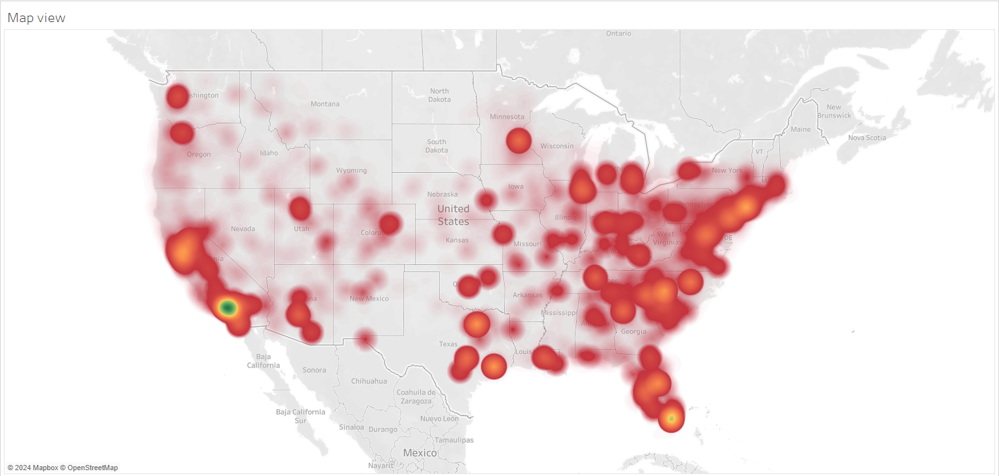
First, we will look at the overall state of occurence of traffic accidents. There is a spot at the bottom left of US, where many of the traffic accidents happens. The accidents happens around the edge of US more often.

&nbsp;

&nbsp;

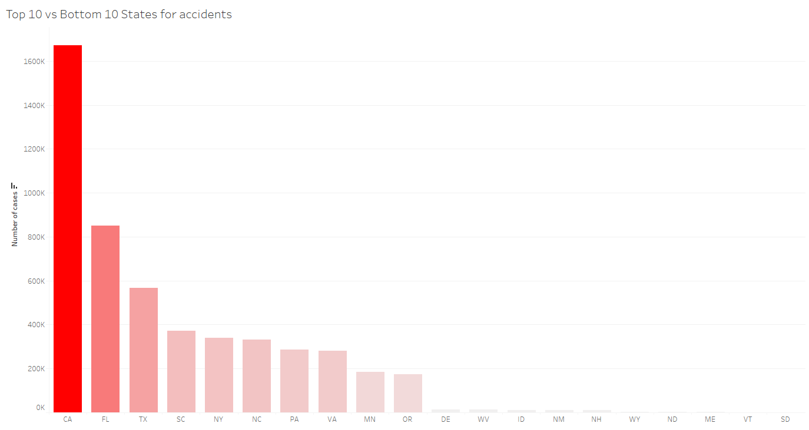
Drilling down to the states, we can see that the states with the highest cases are California, Florida, Texas, South Carolina, New York and so on. The states with the lowest cases are South Dakota, Vermont, Maine, North Dakota, Wyoming and so on. The numbers from the first state to the last state is dramatically different. Compared to South Dakota, California have 7080x more cases of traffic accidents. The difference is alarming. This can be due to the density of the state and the amount of coverage the sources has on different states.

&nbsp;

&nbsp;

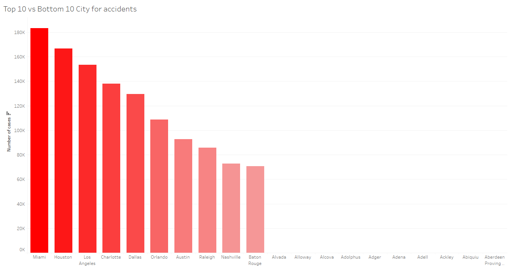
Drilling down to the cities view, we see that the cities with the highest cases are Miami, Houston, Los Angeles, Charlotte, Dallas. The cities with the lowest cases are actually a lot of them in together. There is 761 cities with only 1 traffic accident recorded from 2016 to 2023. This is very suspicious and would seems to be due to the coverage that these cities gets from the media.

&nbsp;

&nbsp;

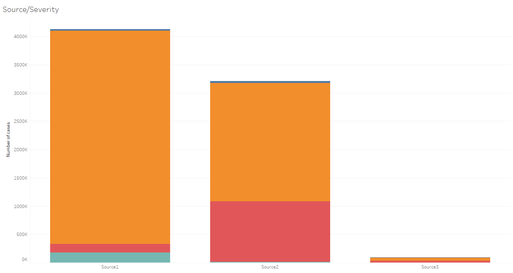
Source 1 have reported more accidents. Also, they have more accidents that is deemed as the worst severity. 
Would look into what are the different sources to understand why Source3 have less than 1% of accident reports compared to Source1 and Source2. 
Knowing the sources also can explain the biasness and accuracy between the sources and make a better assumption of how each sources determine the severity of the accident.

&nbsp;

&nbsp;

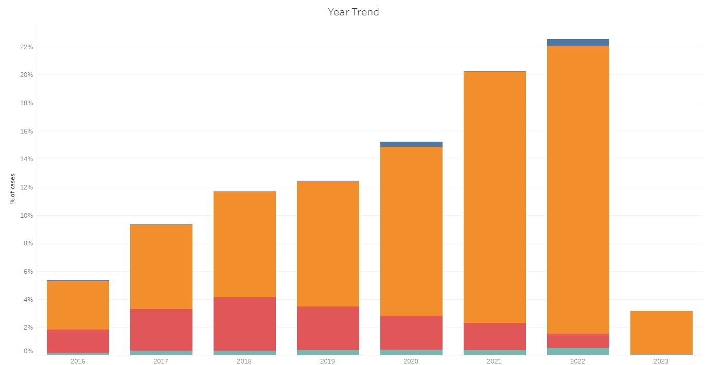
Year on year trend shows something very interesting. The number of traffic accidents have been climbing steadying over the years and it is a cause for concern. However you can see that Severity 3 accidents has been decreasing over the years, while the less serious Severity 2 traffic accidents have been increasing. Overall, traffic accidents has doubled since 2017.

&nbsp;

&nbsp;

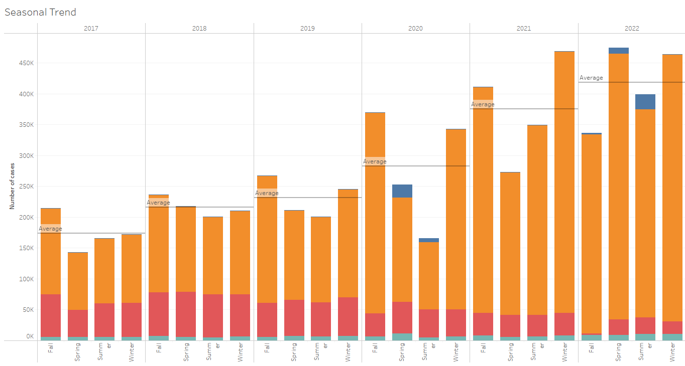
Looking at the seasonal trend of traffic accidents, Fall and Winter are on the top of traffic accidents occurence for most of the time. This could be an interesting focus for policy makers to look into. On the latest year with full seasonal data(2022), we can see that there is a spike of traffic accidents in Spring. This may become a cause of concern and should be closely monitored .

&nbsp;

&nbsp;

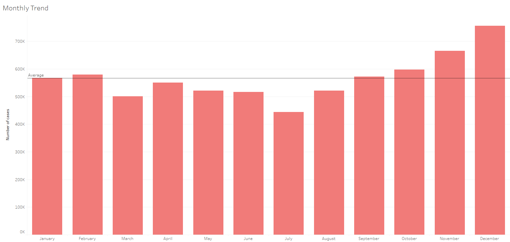
Drilling down the the monthly trend, November and December have the most traffic accidents, while the month with the lowest traffic accidents is July. It seems like the holiday period is a big attractor of traffic accidents. Factors such as slippery floors, crowded streets and bad weather due to snow should be looked into.

&nbsp;

&nbsp;

Drilling futher into days of week, it is quite obvious that the weekdays have way more accidents than the weekends. This could suggest that working days normally gets more traffic accidents. 

&nbsp;

&nbsp;

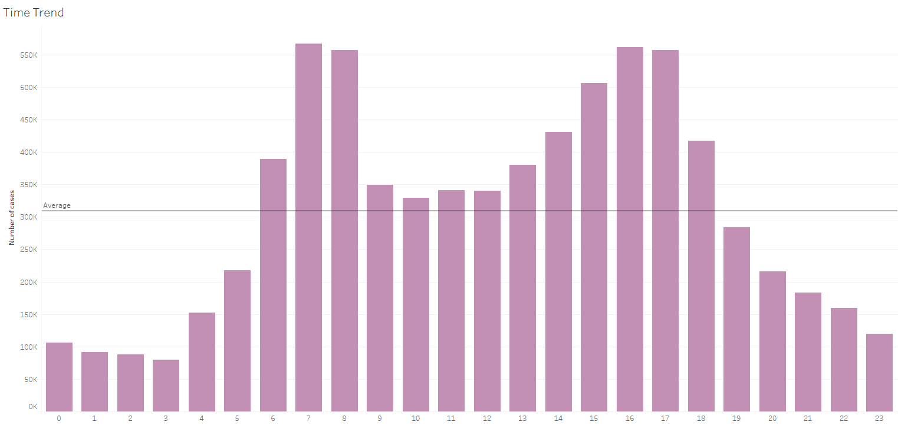
Switching to hourly chart, most accidents occur during the working hours with peaks at the 6am to 8am mark and 3pm to 5pm mark. One reason could be that people are going and leaving for work, which means more commuting, causing more cases of accidents.

&nbsp;

&nbsp;

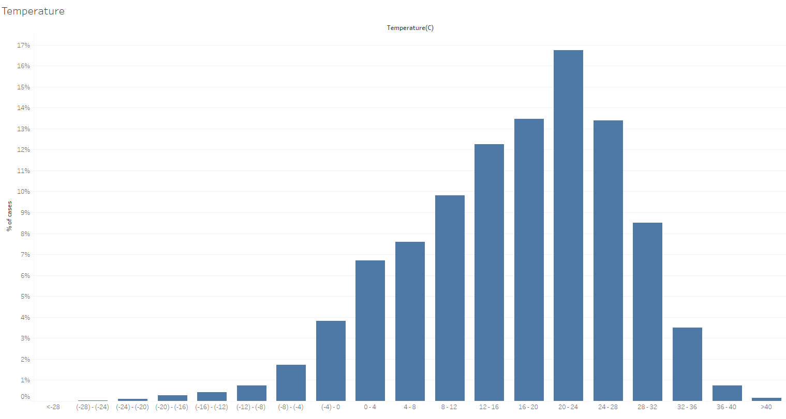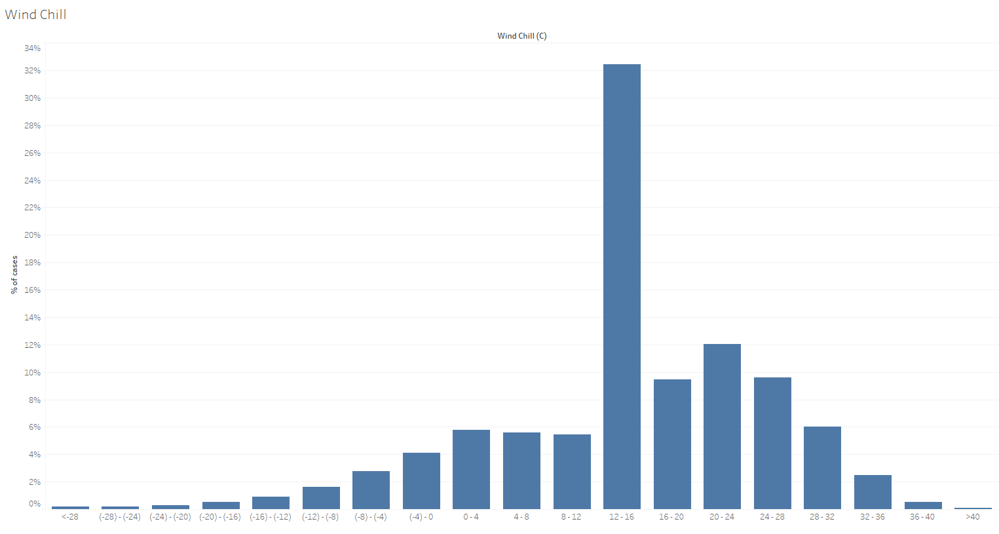
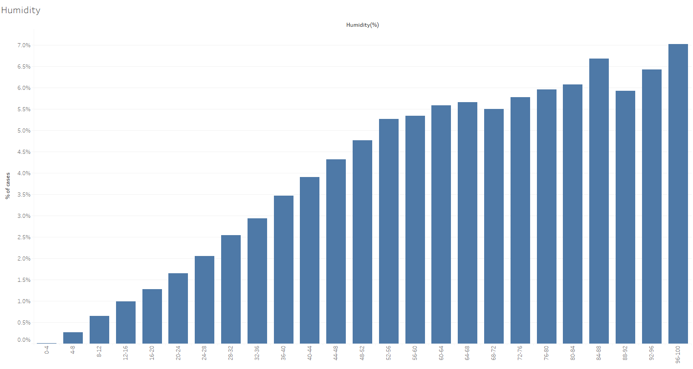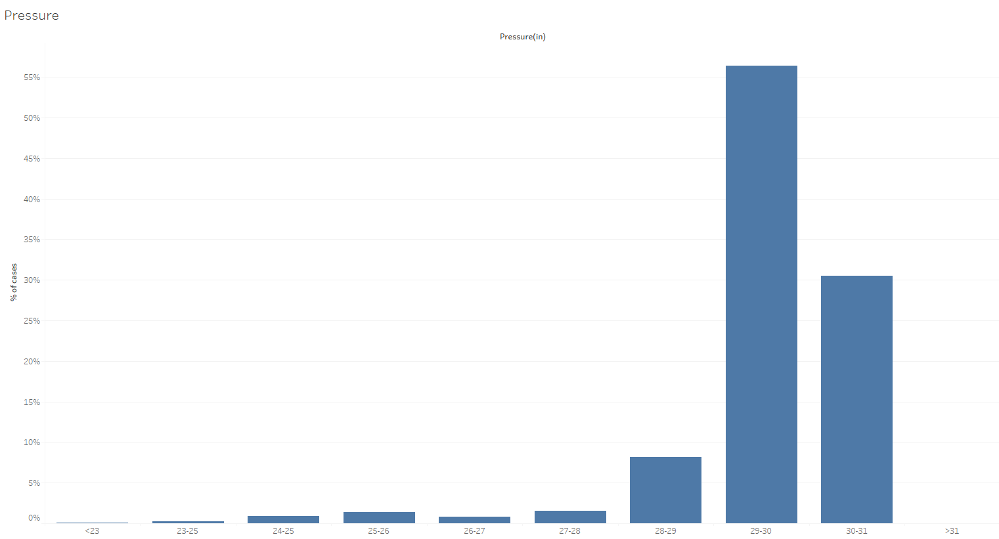
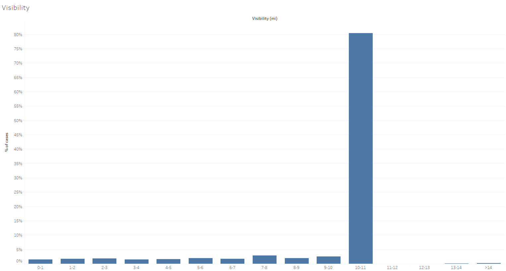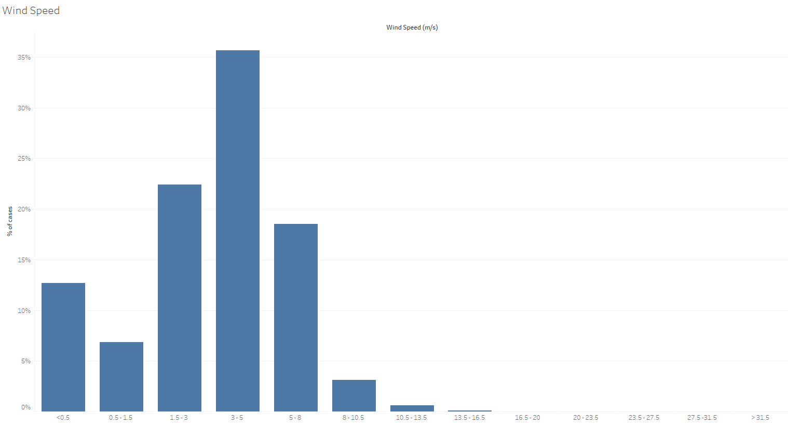

&nbsp;

These are the other factors of weather itself. Most of the traffic accidents take place in the normal range of these factors. There are some interesting insights that could be derived from this.
1) Traffic accidents increases as humidity increases. This could mean that driver's behavior is one of the key factors in traffic accidents as high levels of humidity is linked to worse driver's behavior.
2) Low visibility have many traffic accidents. The usual range of visibility is 10-11 miles. Traffic accidents also dramatically reduced after 11miles, which reinforced the idea that high visibility plays a big part in preventing accidents.

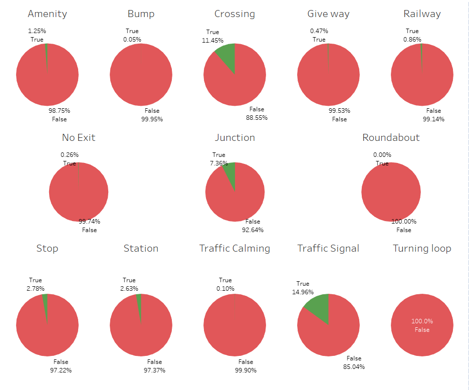
From the dashboard, it seems like accidents happens nearby traffic signals, crossings and junctions. Places with lesser effects are the stop signs, stations and amenities.
Further research should be done near these areas to find out why accidents happens near these areas.

&nbsp;

&nbsp;

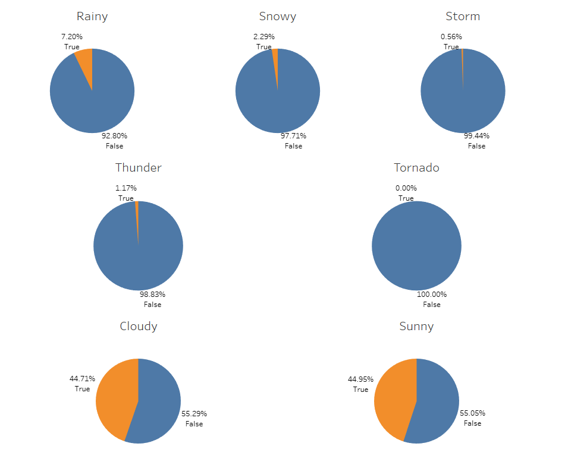
From the dashboard, it seems like accidents happens mostly in sunny and cloudy days. 
It could be derived that visibility plays a big factor in traffic accidents occurring. Driver behaviors may change due to sunny weather and be a cause of traffic accidents.

&nbsp;

&nbsp;

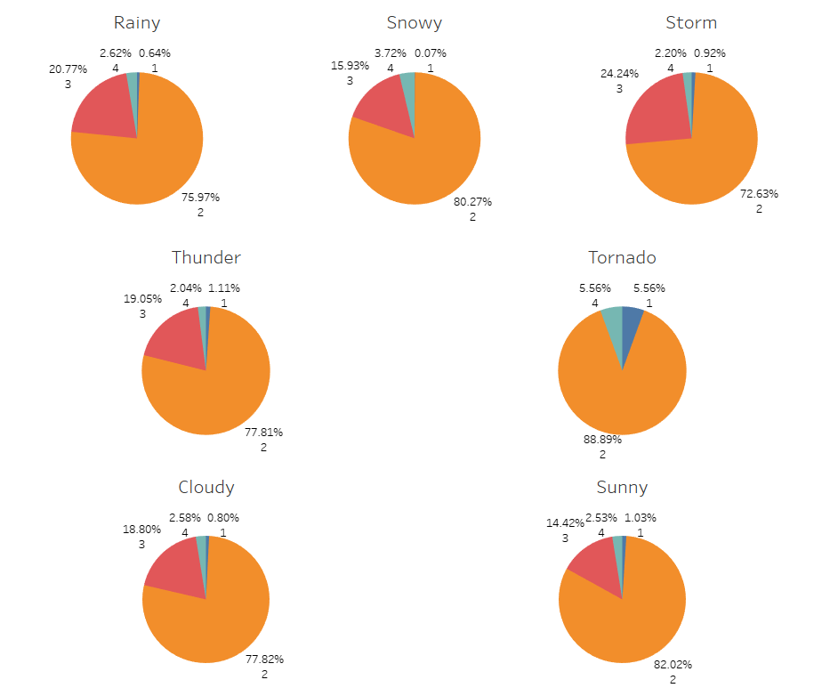
The percentage of severity for each weather conditions seems to be around the same proportion. 
Storm and rainy conditions have the highest proportions of severity 3 accidents while tornado conditions have the highest proportion of severity 4 accidents.

&nbsp;

&nbsp;

# Key Insights📈📊:
1) Number of traffic accidents have doubled from 2017
2) Number of accidents have been Increasing yearly, with the Fall and Winter sesson contributing to more accidents.
3) Weekdays have more traffic accidents than the weekends.
4) Timings with the most traffic accidents are when people are going to work or coming back from work.
5) Visbility plays a big part in preventing accidents.
6) Driver's behavior on the road also affect the number of accidents occuring. Weathers that induce high humidity will probably affect the behavior negatively.

# Challenges Faced📈📊:
1) During the data cleaning process, it was difficult to know what the individual columns meant. It is tough to make out what the units meant and what does some value represent. It took a bit of research to understand.
2) One of the columns, "Weather Condition", have over 100 different descriptions for weather. It is quite a hassle to consolidate them into useful information. To combat that, I have created individual True/False columns and grab the keywords from each of the description to determine whether it falls into these columns.
3) As it is a big file(3.2gb) with over 7 million rows of data, it is difficult to maneuver around the data. After further research into this matter, I have created a way to take only 2% of the data and explore then to get a good feel of the data and created the necessary cleaning methods before inputting all of the data through cleaning and wrangling.

# Future Steps📈📊:
1) Machine learning could be used to learn what are factors that impact traffic accidents the most. This could help futher solidifying ideas to help with reducting traffic accidents overall.
2) Population density is an interesting route and idea to explore. Future analysis may want to include it to gather more insight in this matter.
3) Knowing the sources and how the reports are collected for each of the sources would be great improve clarity of the data. 

# Conclusion📈📊:
In conclusion, the analysis of traffic accidents over the years has revealed a concerning trend of increasing incidents annually. The data paints a vivid picture of the challenges we face on our roads, pointing to a growing need for comprehensive measures to address this escalating issue. The rising number of accidents demands attention from policymakers and the community. 

It is crucial to recognize that tackling the root causes of increasing traffic accidents requires a multi-faceted approach. Collaboration between government agencies, local authorities, and the public is essential to creating and implementing effective solutions. Overall, the data has been insightful and could be futher use to improve the safety of the US roads. 

