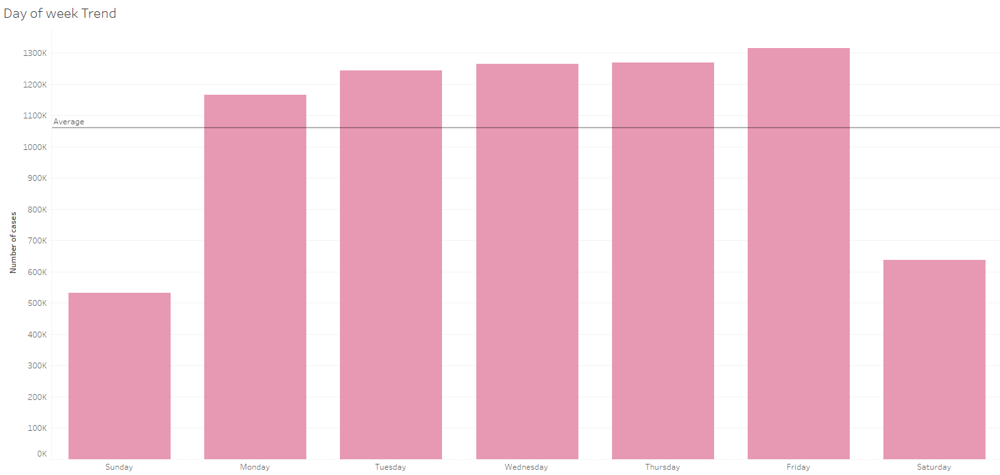
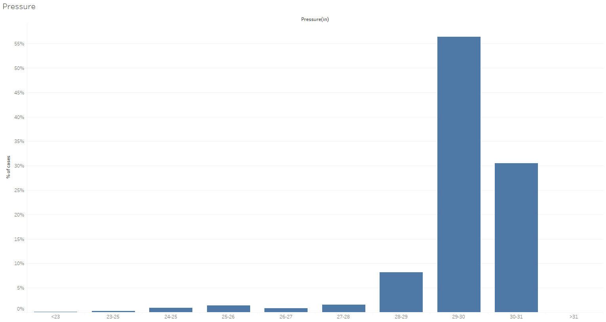

* Link to dataset (too big for github) : https://drive.google.com/drive/folders/1ELKcQACYUjB4YCqhNm5p7lXxZmjS0f6V?usp=sharing
* Tableau visualisation : https://public.tableau.com/app/profile/aloysius.ang/viz/USaccident2016-2023/MainStory

# Overview 📈📊
In this project, I found a dataset on US traffic accidents report from 2016 to 2023. This dataset consist of over 7 million rows with 48 columns of data. It is a huge file. By utilizing Python and tableau, I attempted to perform data wrangling and cleaning. After those processes, the cleaned data set will be transfer to tableau for exploratory data analysis. I am here to share the many insights that had been found within the exploratory data analysis.

# Introduction 📈📊
This extensive dataset captures car accidents nationwide, which consist of 49 states in the USA. This dataset spans from February 2016 to March 2023. It aggregates information from multiple APIs that stream real-time traffic incident data. These APIs source data from diverse entities. This includes the US and state departments of transportation, law enforcement agencies, as well as traffic cameras and sensors embedded in the road networks. The dataset comprises approximately 7.7 million accident records.

The objective of this analysis is to come out with meaningful insights that can inform policy decisions in the US. Using this huge dataset, the aim is to identify key areas of concern and potential pain points. Ultimately, the goal is to provide valuable information to policymakers. Strategic recommendations can be introduced to collectively reduce traffic accidents nationwide. With this analytical process, the effect of this analysis will strive towards making the roads in US safer for all commuters. 

# Purpose 📈📊
The purpose of this analysis is to answer a few questions that I have curated for this dataset after looking at the dataset. Here are the questions:
1. **Trend Analysis**
  * What is the overall trend in the number of traffic accidents over the specified period?
  * Are there any significant increases or decreases in accident rates over the years?
2. **Seasonal Patterns**
  * Is there a pattern in traffic accidents based on seasons (e.g., more accidents during winter or summer)?
3. **Day and Time Analysis**
  * During which days of the week do most accidents occur?
  * What time of the day has the highest frequency of accidents?
4. **Contributing Factors**
  * What are the primary contributing factors to traffic accidents (e.g., weather conditions)?

There is a few more questions that I have thought up that is not possible to answer with the current dataset. I will talk about them in the limitation and improvement section

# Steps Taken📈📊
I will give a general overview of the steps taking for cleaning and wrangling of the dataset. For the actual code, please refer to my code in this repository. 
Here is the steps taken:
1. Look at the percentage of null values for each columns
2. Decide whether the data should be filled up with means of value or dropped from the datset
3. Inspect each of the columns carefully and check the values(ie, if its too much of an outlier)
4. Transform measurements from the imperial system to the metric system
5. Consolidate the values in columns to a more manageable size for better analysis 

After the cleaning and wrangling of data, we move the new dataset to Tableau for visualisatioon and data analysis

# Visualisations
Here are the visualisations created in my tableau, for more interactions and drilldowns, please follow this link or the top of this report

Key Insights:
Summarize the key insights derived from your analysis. This could include trends, patterns, correlations, or any unexpected findings.

Challenges Faced:
Discuss any challenges encountered during the data cleaning process or while creating visualizations. Explain how you addressed these challenges.

Future Steps:
Outline potential next steps or areas for further exploration. This could involve additional analyses, refining visualizations, or incorporating more data sources.

Conclusion:
Summarize the overall findings and the impact of your analysis on understanding US traffic accidents. Conclude with the significance of your work in contributing to road safety or related domains.

Feedback and Contributions:
Encourage others to provide feedback or contribute to your project. Specify how they can get in touch or submit pull requests.
